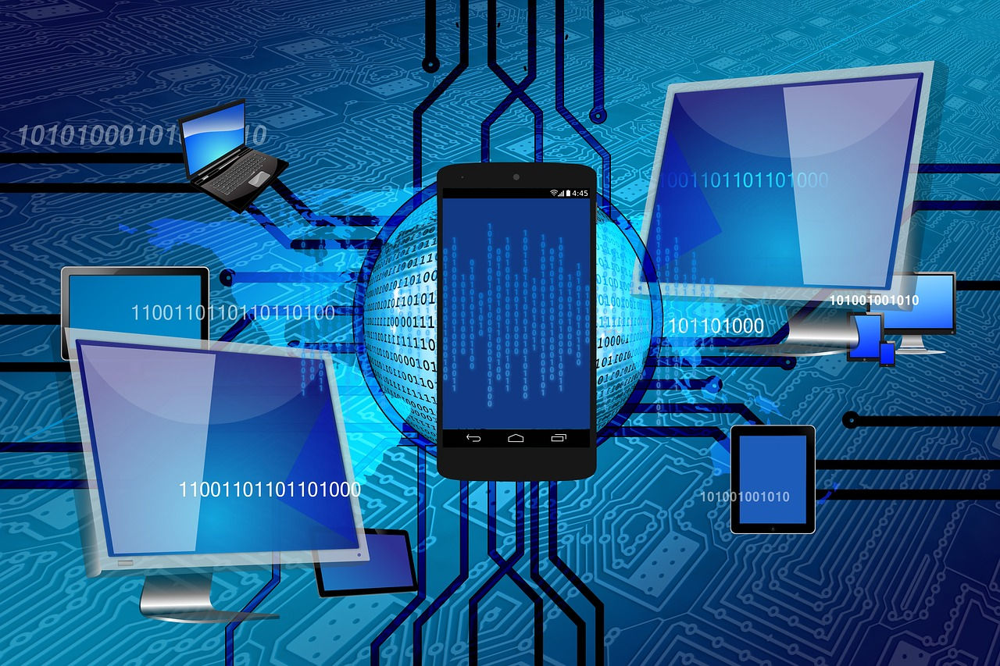

# ICS3U Curriculum - Grade 11 Computer Science Course Outline

ICS3U introduces students to computer science. The ICS3U Curriculum will have Grade 11 Computer Science students design software independently and as part of a team, using industry-standard programming tools and applying the software development life-cycle model. They will also write and use subprograms within computer programs. ICS3U1 students will develop creative solutions for various types of problems as their understanding of the computing environment grows. They will also explore environmental and ergonomic issues, emerging research in computer science, and global career trends in computer-related fields.

Grade 11 Computer Science is about how computers compute.  It is not about learning how to use the computer, and it is much more than computer programming.  Computer studies is the study of ways of representing objects and processes.  It involves defining problems, analyzing problems, designing solutions, and developing, testing, and maintaining programs.  The major focus of the ICS3U Curriculum is the development of programming skills, which are important for success in future postsecondary studies. Introduction to Computer Science is relevant for all students because it incorporates a broad range of transferable problem solving skills and techniques, including logical thinking, creative design, synthesis and evaluation.  It also teaches generically useful skills in areas such as communication, time management, organization, and teamwork.

You can read the entire [Ontario Computer Studies Curriculum](http://www.edu.gov.on.ca/eng/curriculum/secondary/computer10to12_2008.pdf) by visiting the Government of Ontario site.  The expectations identified for each course describe the knowledge and skills that students are expected to develop and demonstrate in their class work.

## ICS3U Unit 0 - The Computational Environment

### ICS3U Curriculum Learning Goals

By the end of this unit ICS3U Grade 11 Computer Science students will be able to

- Understand different types of computer software that exists on a computer
- Setup an organization system on your computer to store your files effectively
- Protect your data from malicious code
- Identify Software with Good and Bad Interfaces
- Explain the basic function of the major components that make up a computer system
- Understand how programming languages are used to interact with hardware
- Work with different types of number systems that computers use

### Lessons for ICS3U1 Grade 11 Computer Science

- Computer Software
- Computer Hardware
- Number Systems
- How Software Interacts with Hardware
- The Computational Environment Evaluation

### Grade 11 Computer Science - ICS3U Curriculum Expectations

ICS3U1 Specific Curriculum Expectations

- A1.2 – Demonstrate an understanding of how a computer uses various systems (e.g., binary, hexadecimal, ASCII, Unicode) to internally represent data and store information;
- C1.1 – Relate the specifications of the internal components of a computer (e.g., CPU, RAM, ROM, cache, hard drive, motherboard, power supply, video card, sound card) to user requirements;
- C1.2 – Relate computer specifications (e.g., processor type, bus speed, storage capacity, amount of memory) to user requirements, using correct terminology;
- C1.3 – Relate the specifications of common computer peripheral devices (e.g., printer, monitor, scanner, keyboard, mouse, speakers, USB flash drive) to user requirements;
- C1.4 – Identify the computer components involved in executing programming operations (e.g., assignment statements store a value in RAM, arithmetic operations are performed in the CPU).
- C2.1 – Use an operating system to organize computer programs and files logically on local and shared drives;
- C2.2 – Describe procedures to safeguard data and programs from malware (e.g., viruses, Trojan horses, worms, spyware, adware, malevolent macros), and devise a thorough system protection plan;
- C2.3 – Use standard procedures to back up and archive user files.
- C3.3 – Explain the difference between source code and machine code;
- C3.4 – Explain the difference between an interpreter and a compiler;
- C3.5 – Explain the difference between the functions of applications, programming languages, and operating systems.

